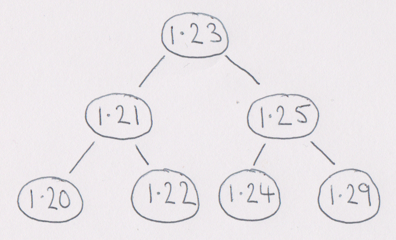
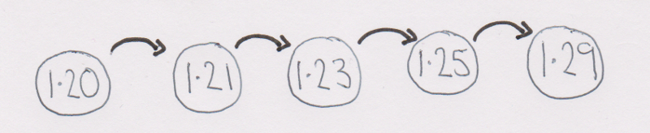
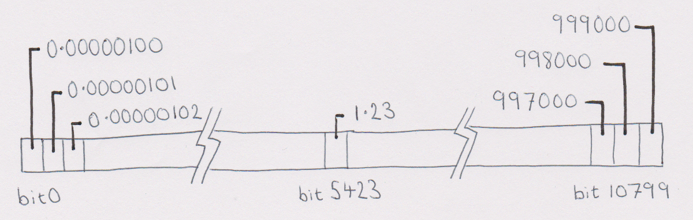

In our first UbiTok.io blog post, I'm going to introduce the technique we've developed to efficiently maintain an order book entirely on the Ethereum blockchain, including performing best execution matching.

| Bids  | Asks |
| ----- | ---- |
| Buy 100 @ 1.20  | Sell 200 @ 1.23 |
| Buy 500 @ 1.10  | Sell 100 @ 1.24 |
|                 | Sell 900 @ 1.30 |

A limit order book is simply a set of open buy orders and a set of open sell orders. But to be useful, it needs to let us easily:
 - see if a new order will match any existing orders on the opposite side, and remove the existing orders if it does;
 - add a new order that didn't fully match;
 - remove a cancelled order.

When matching orders, we want best execution - for example, if there is one open sell order at a price of 1.23 and another @ 1.24, if I put in a buy order at @1.25, my order should match the sell order @ 1.23 first.

Now, if you were implementing a centralised exchange in a normal programming language, you'd probably store each side of the book as an ordered map from price to the orders at that price.

```text
1.23 => [ SELL 200 ]
1.24 => [ SELL 100 ]
1.30 => [ SELL 400, SELL 500 ]
```

Behind the scenes, the ordered map would probably use a [Tree](https://en.wikipedia.org/wiki/Tree_%28data_structure%29) - as [Java's TreeMap](https://docs.oracle.com/javase/8/docs/api/java/util/TreeMap.html) does.

On paper, trees are great - they let us cheaply add and remove entries, as well as walk through the entries in order of price starting from a given price.



However, the Ethereum Virtual Machine is not a normal programming environment. In particular, reading from and writing to storage costs gas, which has to be paid by the user. This is fair enough - we have to compensate the Ethereum network for hosting our order book on thousands of computers.

Sadly, in this environment a tree is a bad choice because they're only cheap on average. The worst case behaviour can be quite bad - for example, some poor user who just wants to cancel her order could end up paying a huge gas fee because removing her order ends up rebalancing the whole tree (which involves many writes).

So what can we do instead? How about a linked list - they're predictable, cheap to update and easy to walk through?

That's true, but we want to walk through the open orders starting at a given price. A linked only lets us start at one end of the list - there's no way to jump to the middle. It would be dangerous to have a contract where one person adding more orders makes everyone else have to spend more gas, especially since there is a limit on how much gas a transaction can use.



Now, we could keep our linked list sorted so that the most generous prices are at the start - that would work well for matching orders. However, a client wanting to add an order further down the book would have to spend more gas to skip to where their new order belongs. So that won't work well on-chain either.

What we can do to solve the problem is first simplify it by restricting how many different prices can be offered.

Let's start by limiting our prices to the 12 orders of magnitude from 0.000001 to 1000000. After all, if we encounter a token with a very low value we could always trade it in a different unit (MegaTokens, anyone?).

Next, let's restrict ourselves to three significant figures - so prices look like 4.56, not 4.5629470. Admittedly that does lead to bigger spreads - but this isn't uncommon on traditional stock exchanges.

If we were to write down all the prices possible under these rules, we'd find there are 10800 different prices, starting with 0.00000100, 0.00000101, 0.0000102, and with 1.22, 1.23, 1.24 near the middle, and finally ending 997000, 998000, 999000.

We can use one bit for each price to record if there are any open orders at that price - a 1 bit means there are, and a 0 bit means there's no orders at that price.

Since there's 10800 prices, we need 10800 bits:



One nice thing about the Ethereum Virtual Machine is that it uses 256-bit words - which means that just 43 storage locations can hold all 10800 bits.

For example, suppose we have an open sell order at a price of 1.23. It turns out that 1.23 is the 5423rd most generous sell price possible, so we need to set the 5423rd bit to 1. Since each storage location holds 256 bits, more precisely we need to set the 47th bit of the 21st storage location, since 21 x 256 + 47 is 5423.

By using this bitmap technique we can cheaply record and check which prices have orders and quickly skip to a particular price. We can also walk through adjacent prices without having to read from storage - we just look at different bits in the word we already read.

Here's some solidity code - slightly simplified from the [real contract](https://github.com/bonnag/ubitok-contracts/blob/master/contracts/BookERC20EthV1.sol) - showing the idea:

```Solidity

// array of bits representing prices with orders
uint256[43] occupiedPriceBitmaps;

function foundOrdersAt(uint16 priceIndex) public constant {
    // not shown
}

// call foundOrdersAt with all the prices above priceStart
// that have one or more open orders
function walkBookSideFrom(uint16 priceStart)
        public constant returns (uint count) {

  // figure out which bit of which word we start from
  
  uint wordIndex = priceStart / 256;
  uint bitIndex = priceStart % 256;

  // figure out which bit of which word we end at

  uint priceEnd = 10799;
  uint wordEnd = priceEnd / 256;
  uint bitEnd = priceEnd % 256;

  // the current word (with examined/skipped bits shifted off)

  uint word = occupiedPriceBitmaps[wordIndex] >> bitIndex;

  uint16 priceIndex; // we reconstruct the price when needed
  
  // loop through from the start word up to the penultimate one

  while (wordIndex < wordEnd) {
    if (word == 0 || bitIndex == 256) {
      // no more non-zero bits or no more bits in this word
      bitIndex = 0;
      wordIndex++;
      word = occupiedPriceBitmaps[wordIndex];
    } else {
      if ((word & 1) != 0) {
        priceIndex = uint16(wordIndex * 256 + bitIndex);
        foundOrdersAt(priceIndex);
      }
      bitIndex++;
      word >> 1;
    }
  }

  // in the final word we may have to stop earlier

  while (bitIndex <= bitEnd && word != 0) {
    if ((word & 1) != 0) {
      priceIndex = uint16(wordIndex * 256 + bitIndex);
      foundOrdersAt(priceIndex);
    }
    bitIndex++;
    word >> 1;
  }

}

```


Of course, we still have to record the orders at each price - more about that in a future post.
